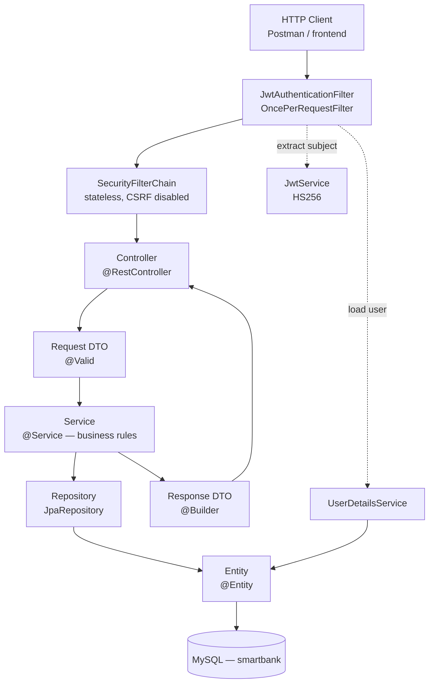
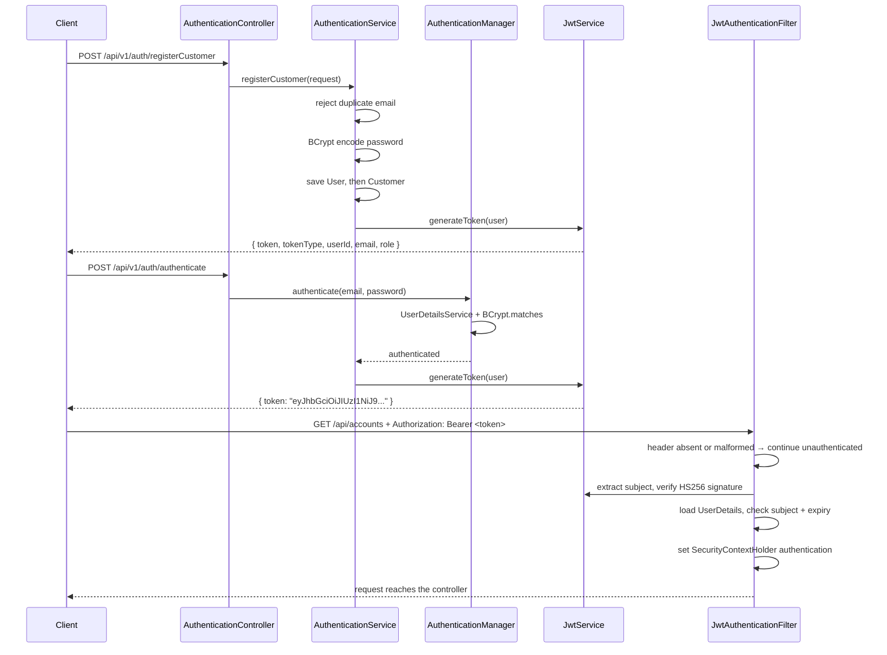
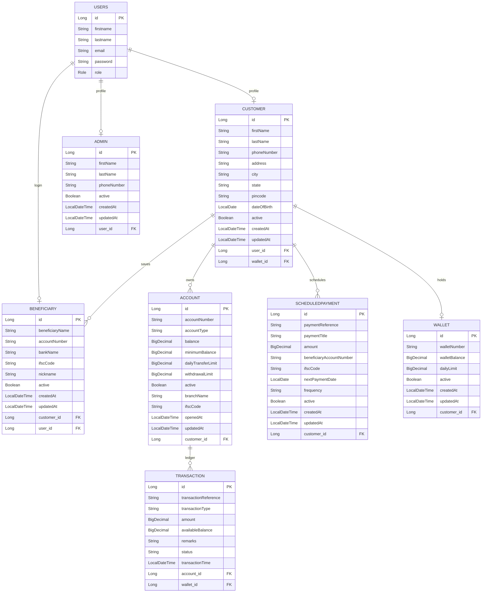

# Smart Banking Backend


A REST API for retail banking operations, built with Java 21 and Spring Boot 3. It covers stateless JWT authentication, bank accounts, a digital wallet, fund transfers with limit enforcement, saved beneficiaries, and standing instructions.

> **Project status: learning project, in active development.** Authentication and the core domain model are working. Several known defects and gaps are documented openly in [Known Limitations](#known-limitations) — this is not production software and is not deployed anywhere.

---

## Table of Contents

- [Project Overview](#project-overview)
- [Features](#features)
- [Tech Stack](#tech-stack)
- [Architecture](#architecture)
- [Project Structure](#project-structure)
- [Authentication Flow](#authentication-flow)
- [Database Design](#database-design)
- [API Documentation](#api-documentation)
- [Authentication & Authorization](#authentication--authorization)
- [Exception Handling](#exception-handling)
- [Validation](#validation)
- [Installation & Setup](#installation--setup)
- [Database Configuration](#database-configuration)
- [Running the Application](#running-the-application)
- [Swagger API Documentation](#swagger-api-documentation)
- [Testing](#testing)
- [Known Limitations](#known-limitations)
- [Future Improvements](#future-improvements)
- [Project Rating](#project-rating)
- [Author](#author)

---

## Project Overview

Smart Banking Backend is the server-side layer a banking web or mobile client would call. It handles identity, account balances, and money movement.

**What it solves.** A banking client needs three things from its backend: a way to prove who the caller is without keeping server-side sessions, a durable record of balances, and money-movement operations that respect the bank's rules — minimum balance, daily transfer limits, withdrawal limits, and account status. This project implements all three over a MySQL schema of nine entities.

**Users.** Three roles are modelled as a `Role` enum:

| Role | Intended scope |
|---|---|
| `CUSTOMER` | Own accounts, own wallet, own beneficiaries and standing instructions |
| `ADMIN` | Bank-wide account administration |
| `BENEFICIARY` | A registered payee identity |

---

## Features

### Implemented

- **Stateless JWT authentication** — HS256 tokens, 24-hour expiry, no server-side session
- **BCrypt password hashing** through a Spring Security `PasswordEncoder` bean
- **Three registration flows** — customer, admin, and beneficiary, each creating a `users` row plus a linked profile row
- **Bank account management** — open, read, update, activate, deactivate, lookup by account number, balance enquiry
- **Deposits and withdrawals** with active-account and amount checks
- **Account-to-account transfers** enforcing insufficient-balance, same-account, minimum-balance, and daily-limit rules
- **Digital wallet** — create, add money, withdraw, wallet-to-wallet transfer
- **Beneficiary management** scoped to a customer
- **Scheduled payment records** — create, update, activate, deactivate, delete
- **Transaction ledger** with UUID references and per-account statement retrieval
- **Bean Validation** on all create requests, including IFSC, Indian pincode, mobile-number, and account-number formats
- **`BigDecimal` throughout** for monetary values, compared with `compareTo`

### Not implemented

Listed deliberately so the scope is unambiguous:

- Role-based authorization — the `Role` enum and granted authorities exist, but no endpoint enforces a role or verifies resource ownership
- Scheduled-payment execution — records are stored, but there is no scheduler that runs them
- Refresh tokens, logout, or token revocation
- Global exception handling — business failures currently surface as HTTP 500
- Swagger / OpenAPI
- Pagination, sorting, and search
- Automated tests beyond a context-load check
- Docker, CI/CD, caching, rate limiting

---

## Tech Stack

| Layer | Technology |
|---|---|
| Language | Java 21 |
| Framework | Spring Boot 3.5.3 |
| Web | Spring Web (MVC), REST |
| Persistence | Spring Data JPA, Hibernate |
| Database | MySQL 8.x |
| Security | Spring Security 6, BCrypt |
| Tokens | JJWT 0.13.0 (`jjwt-api`, `jjwt-impl`, `jjwt-jackson`), HS256 |
| Validation | Jakarta Bean Validation via `spring-boot-starter-validation` |
| Boilerplate | Lombok |
| Build | Maven (with Maven Wrapper) |
| Test libraries | JUnit 5, Mockito, AssertJ — on the classpath via `spring-boot-starter-test`, not yet used |

---

## Architecture

The application follows a layered architecture. Every feature moves through the same path, so any class can be located from its role.



**Patterns applied:** Layered Architecture · MVC (REST) · DTO Pattern · Repository Pattern · Service Layer · Dependency Injection · Stateless REST

---

## Project Structure

```text
src/main/java/com/sbb/api
├── SmartBankingBackendApplication.java
├── controller
│   ├── AuthenticationController.java
│   ├── CustomerController.java
│   ├── AccountController.java
│   ├── TransactionController.java
│   ├── WalletController.java
│   ├── BeneficiaryController.java
│   ├── ScheduledPaymentController.java
│   └── AdminController.java
├── service
│   ├── AuthenticationService.java
│   ├── CustomerService.java
│   ├── AccountService.java
│   ├── TransactionService.java
│   ├── WalletService.java
│   ├── BeneficiaryService.java
│   ├── ScheduledPaymentService.java
│   └── AdminService.java
├── dao                                  # Spring Data JPA repositories
│   ├── UserRepository.java
│   ├── CustomerRepository.java
│   ├── AccountRepository.java
│   ├── TransactionRepository.java
│   ├── WalletRepository.java
│   ├── BeneficiaryRepository.java
│   ├── ScheduledPaymentRepository.java
│   └── AdminRepository.java
├── entity
│   ├── User.java                        # implements UserDetails
│   ├── Role.java                        # enum: ADMIN, CUSTOMER, BENEFICIARY
│   ├── Customer.java
│   ├── Account.java
│   ├── Transaction.java
│   ├── Wallet.java
│   ├── Beneficiary.java
│   ├── ScheduledPayment.java
│   └── Admin.java
├── dto
│   ├── auth                             # BaseRegisterRequest + 3 subclasses, LoginRequest, AuthenticationResponse
│   ├── customer
│   ├── account
│   ├── transaction
│   ├── wallet
│   ├── beneficiary
│   ├── scheduledpayment
│   └── admin
└── security
    ├── SecurityConfiguration.java       # SecurityFilterChain
    ├── ApplicationConfig.java           # UserDetailsService, AuthenticationProvider, PasswordEncoder
    ├── JwtService.java                  # generation and validation
    └── JwtAuthenticationFilter.java

src/main/resources
└── application.properties

src/test/java/com/sbb/api
└── SmartBankingBackendApplicationTests.java
```

There is no `exception` or `config` package yet — see [Future Improvements](#future-improvements).

---

## Authentication Flow

Authentication is stateless. The server keeps no session; every protected request carries its own proof.



**Steps in order**

1. **Register** — email uniqueness is checked, the password is BCrypt-hashed, a `users` row and a profile row are saved, and a token is returned immediately.
2. **Login** — `AuthenticationManager` delegates to `DaoAuthenticationProvider`, which loads the user via `UserDetailsService` and compares the password with BCrypt.
3. **Token issue** — `JwtService` signs an HS256 token with the user's email as the subject and a 24-hour expiry.
4. **Token use** — the client sends `Authorization: Bearer <token>`.
5. **Filter** — `JwtAuthenticationFilter` (a `OncePerRequestFilter` registered before `UsernamePasswordAuthenticationFilter`) extracts the subject, verifies the signature and expiry, loads the `UserDetails`, and populates the `SecurityContextHolder`.
6. **Access** — the request reaches the controller with an authenticated principal.

---

## Database Design

Schema is generated by Hibernate from the entity mappings.



**Relationship summary**

| Relationship | Mapping | Owning side |
|---|---|---|
| `User` ↔ `Customer` | One-to-One | `Customer.user_id` |
| `User` ↔ `Admin` | One-to-One | `Admin.user_id` |
| `User` ↔ `Beneficiary` | One-to-One | `Beneficiary.user_id` |
| `Customer` → `Account` | One-to-Many | `Account.customer_id` |
| `Customer` → `Beneficiary` | One-to-Many | `Beneficiary.customer_id` |
| `Customer` → `ScheduledPayment` | One-to-Many | `ScheduledPayment.customer_id` |
| `Customer` ↔ `Wallet` | One-to-One (currently mapped with two independent FKs — see Known Limitations) | `Wallet.customer_id` |
| `Account` → `Transaction` | One-to-Many | `Transaction.account_id` |

`@OneToMany` collections are LAZY; `@ManyToOne` and `@OneToOne` associations use the JPA default of EAGER. No cascade or `orphanRemoval` is configured, so child rows are managed explicitly.

---

## API Documentation

**Base URL:** `http://localhost:8080`
All endpoints except `/api/v1/auth/**` require `Authorization: Bearer <token>`.

### Authentication — public

| Method | Endpoint | Purpose |
|---|---|---|
| POST | `/api/v1/auth/registerCustomer` | Register a customer, returns a JWT |
| POST | `/api/v1/auth/registerAdmin` | Register an admin, returns a JWT |
| POST | `/api/v1/auth/registerBeneficiary` | Register a beneficiary, returns a JWT |
| POST | `/api/v1/auth/authenticate` | Log in, returns a JWT |

### Customers — `/api/users`

| Method | Endpoint | Purpose |
|---|---|---|
| POST | `/api/users` | Create a customer profile |
| GET | `/api/users/{id}` | Fetch a customer |
| GET | `/api/users` | List customers |
| PUT | `/api/users/{id}` | Update a customer |
| DELETE | `/api/users/{id}` | Delete a customer |

### Accounts — `/api/accounts`

| Method | Endpoint | Purpose |
|---|---|---|
| POST | `/api/accounts` | Open an account for a customer |
| GET | `/api/accounts/{id}` | Fetch an account by id |
| GET | `/api/accounts` | List accounts |
| PUT | `/api/accounts/{id}` | Update account details |
| DELETE | `/api/accounts/{id}` | Delete an account |
| GET | `/api/accounts/number/{accountNumber}` | Fetch by account number |
| GET | `/api/accounts/balance/{accountNumber}` | Balance enquiry |
| PUT | `/api/accounts/{id}/activate` | Activate |
| PUT | `/api/accounts/{id}/deactivate` | Deactivate |

### Transactions — `/api/transactions`

| Method | Endpoint | Purpose |
|---|---|---|
| POST | `/api/transactions/deposit` | Credit an account |
| POST | `/api/transactions/withdraw` | Debit an account |
| POST | `/api/transactions/transfer` | Account-to-account transfer |
| GET | `/api/transactions/{id}` | Fetch a transaction |
| GET | `/api/transactions` | List transactions |
| GET | `/api/transactions/account/{accountNumber}` | Statement for an account |
| DELETE | `/api/transactions/{id}` | Delete a transaction record |

### Wallet — `/api/wallets`

| Method | Endpoint | Purpose |
|---|---|---|
| POST | `/api/wallets` | Create a wallet for a customer |
| GET | `/api/wallets/{id}` | Fetch a wallet |
| POST | `/api/wallets/add-money` | Credit a wallet |
| POST | `/api/wallets/withdraw` | Debit a wallet |
| POST | `/api/wallets/transfer` | Wallet-to-wallet transfer |
| DELETE | `/api/wallets/{id}` | Delete a wallet |

### Beneficiaries — `/api/beneficiaries`

| Method | Endpoint | Purpose |
|---|---|---|
| POST | `/api/beneficiaries` | Add a beneficiary |
| GET | `/api/beneficiaries/{id}` | Fetch a beneficiary |
| GET | `/api/beneficiaries/customer/{customerId}` | List a customer's beneficiaries |
| PUT | `/api/beneficiaries/{id}` | Update a beneficiary |
| DELETE | `/api/beneficiaries/{id}` | Delete a beneficiary |

### Scheduled Payments — `/api/scheduled-payments`

| Method | Endpoint | Purpose |
|---|---|---|
| POST | `/api/scheduled-payments` | Create a standing instruction |
| GET | `/api/scheduled-payments/{id}` | Fetch one |
| GET | `/api/scheduled-payments/customer/{customerId}` | List a customer's instructions |
| PUT | `/api/scheduled-payments/{id}` | Update |
| PUT | `/api/scheduled-payments/{id}/activate` | Activate |
| PUT | `/api/scheduled-payments/{id}/deactivate` | Deactivate |
| DELETE | `/api/scheduled-payments/{id}` | Delete |

### Admins — `/api/v1/admins`

| Method | Endpoint | Purpose |
|---|---|---|
| POST | `/api/v1/admins` | Create an admin profile |
| GET | `/api/v1/admins` | List admins |
| GET | `/api/v1/admins/{id}` | Fetch an admin |
| PUT | `/api/v1/admins/{id}` | Update an admin |
| DELETE | `/api/v1/admins/{id}` | Deactivate an admin |

### Sample requests

**Register**

```bash
curl -X POST http://localhost:8080/api/v1/auth/registerCustomer \
  -H "Content-Type: application/json" \
  -d '{
    "email": "customer@example.com",
    "password": "<your-password>",
    "phoneNumber": "9876543210",
    "firstName": "Asha",
    "lastName": "Verma",
    "address": "12 MG Road",
    "city": "Delhi",
    "state": "Delhi",
    "pincode": "110001",
    "dateOfBirth": "1998-04-12"
  }'
```

**Log in**

```bash
curl -X POST http://localhost:8080/api/v1/auth/authenticate \
  -H "Content-Type: application/json" \
  -d '{"email": "customer@example.com", "password": "<your-password>"}'
```

**Call a protected endpoint**

```bash
curl -X GET http://localhost:8080/api/accounts/balance/123456789012 \
  -H "Authorization: Bearer <token-from-login>"
```

---

## Authentication & Authorization

**Authentication — implemented.** `SecurityConfiguration` declares a `SecurityFilterChain` that:

- disables CSRF (correct for a stateless token API — there is no session cookie to forge)
- permits `/api/v1/auth/**` and `/error`
- requires authentication on every other request
- sets `SessionCreationPolicy.STATELESS`
- registers the `DaoAuthenticationProvider` and inserts `JwtAuthenticationFilter` before `UsernamePasswordAuthenticationFilter`

**Authorization — not yet implemented.** `User.getAuthorities()` correctly returns `ROLE_ADMIN`, `ROLE_CUSTOMER`, or `ROLE_BENEFICIARY`, but no endpoint consults them, and no service verifies that the caller owns the resource it is acting on. Any authenticated user currently reaches every endpoint. Closing this is Priority 1 — see [Future Improvements](#future-improvements).

### Role matrix — intended design, not current behaviour

| Capability | ADMIN | CUSTOMER | BENEFICIARY |
|---|:--:|:--:|:--:|
| Register / log in | ✓ | ✓ | ✓ |
| Open or close accounts | ✓ | — | — |
| List all customers or accounts | ✓ | — | — |
| Own account balance and statement | ✓ | ✓ | — |
| Deposit / withdraw / transfer on own account | — | ✓ | — |
| Manage own beneficiaries | — | ✓ | — |
| Manage own standing instructions | — | ✓ | — |
| Receive transfers | — | — | ✓ |

---

## Exception Handling

**Current state: minimal, and a known weakness.**

- Services throw `RuntimeException` with a descriptive message for domain failures — account not found, inactive account, insufficient balance, minimum balance breach, daily limit exceeded, transfer to the same account.
- `TransactionService.transfer` throws `IllegalArgumentException` for missing or non-positive inputs.
- `UserDetailsService` throws `UsernameNotFoundException` for an unknown email.

There is **no `@ControllerAdvice`**, so every one of these reaches the client as HTTP 500 with Spring's default error body. Adding a `@RestControllerAdvice` that maps custom exceptions to 400, 404, and 422 is the first item on the roadmap.

---

## Validation

Jakarta Bean Validation runs via `@Valid` on the create endpoints.

| Field | Constraint |
|---|---|
| Email | `@Email`, `@NotBlank` |
| Password | `@NotBlank`, `@Size(min = 8)` |
| Phone number | `^[6-9]\d{9}$` |
| Account number | `^[0-9]{9,18}$` |
| IFSC code | `^[A-Z]{4}0[A-Z0-9]{6}$` |
| Pincode | `^[1-9][0-9]{5}$` |
| Name fields | `^[A-Za-z ]{2,50}$` |
| Account type | `^(SAVINGS\|CURRENT)$` |
| Transaction type | `^(DEPOSIT\|WITHDRAWAL\|TRANSFER\|PAYMENT)$` |
| Frequency | `^(DAILY\|WEEKLY\|MONTHLY\|QUARTERLY\|YEARLY)$` |
| Amount | `@DecimalMin("0.01")`, `@Digits(integer = 12, fraction = 2)` |
| Date of birth | `@NotNull`, `@Past` |
| Next payment date | `@NotNull`, `@FutureOrPresent` |

**Known gaps:** the four `/api/v1/auth` endpoints are missing `@Valid`, so the registration constraints above do not currently execute. The `*UpdateRequest` DTOs carry no constraints, so `PUT` requests bypass the rules that `POST` enforces.

Business-rule validation lives in the service layer: active-account checks, positive-amount checks, insufficient-balance checks, minimum-balance enforcement, daily transfer and withdrawal limits, and same-account transfer rejection.

---

## Installation & Setup

### Prerequisites

| Requirement | Version |
|---|---|
| JDK | 21 or later |
| MySQL | 8.0 or later |
| Maven | 3.9+ (or use the bundled wrapper) |
| Git | any recent version |

### Steps

**1. Clone**

```bash
git clone https://github.com/<your-username>/SmartBankingBackend.git
cd SmartBankingBackend
```

**2. Create the database**

```sql
CREATE DATABASE smartbank
  CHARACTER SET utf8mb4
  COLLATE utf8mb4_unicode_ci;
```

Tables are created automatically by Hibernate on first start.

**3. Configure credentials** — see the next section.

**4. Build**

```bash
./mvnw clean install
```

---

## Database Configuration

`src/main/resources/application.properties`:

```properties
spring.application.name=SmartBankingBackend
server.port=8080

spring.datasource.url=jdbc:mysql://localhost:3306/smartbank
spring.datasource.username=${DB_USERNAME}
spring.datasource.password=${DB_PASSWORD}

spring.jpa.hibernate.ddl-auto=update
spring.jpa.show-sql=true
spring.jpa.properties.hibernate.format_sql=true

application.security.jwt.secret-key=${JWT_SECRET}
application.security.jwt.expiration=86400000
```

Supply the values as environment variables:

```bash
export DB_USERNAME=<your-mysql-username>
export DB_PASSWORD=<your-mysql-password>
export JWT_SECRET=<your-base64-encoded-256-bit-key>
```

> **Never commit real credentials.** Keep `application.properties` in `.gitignore` and commit an `application.properties.example` with placeholders instead. Generate a signing key with:
> ```bash
> openssl rand -base64 64
> ```

---

## Running the Application

```bash
# Development
./mvnw spring-boot:run

# Package and run
./mvnw clean package
java -jar target/SmartBankingBackend-0.0.1-SNAPSHOT.jar

# Skip tests during packaging
./mvnw clean package -DskipTests

# Run the test suite
./mvnw test
```

The API starts on `http://localhost:8080`.

---

## Swagger API Documentation

**Not currently implemented.** There is no `springdoc-openapi` or `springfox` dependency in `pom.xml` and no OpenAPI configuration class.

To add it:

```xml
<dependency>
    <groupId>org.springdoc</groupId>
    <artifactId>springdoc-openapi-starter-webmvc-ui</artifactId>
    <version>2.6.0</version>
</dependency>
```

The UI would then be served at `http://localhost:8080/swagger-ui.html`, and `/v3/api-docs` and `/swagger-ui/**` would need adding to the `permitAll()` matchers in `SecurityConfiguration`.

Until then, the endpoint tables above are the API reference.

---

## Testing

**Current coverage: effectively zero.**

The only test in the repository is:

```java
@SpringBootTest
class SmartBankingBackendApplicationTests {
    @Test
    void contextLoads() { }
}
```

This verifies that the Spring application context starts. There are no unit tests, no repository tests, and no controller tests. JUnit 5, Mockito, and AssertJ are on the classpath via `spring-boot-starter-test` but are not used.

**Planned test suite:**

| Type | Target |
|---|---|
| Unit (Mockito) | `TransactionService` and `WalletService` — insufficient balance, limit exceeded, minimum balance, inactive account, same-account transfer, and balance-after-withdrawal assertions |
| Repository (`@DataJpaTest`) | The custom JPQL aggregate queries in `TransactionRepository` and `WalletRepository` |
| Controller (`@WebMvcTest` + `MockMvc`) | Status codes, validation error bodies, and unauthorized access |
| Integration (`@SpringBootTest`) | Full register → login → open account → deposit → transfer flow |

---

## Known Limitations

Documented openly rather than hidden — these are the honest state of the project.

| Area | Limitation |
|---|---|
| Authorization | No endpoint enforces a role, and no service checks resource ownership. Any authenticated user can reach any endpoint |
| Admin registration | `/api/v1/auth/registerAdmin` is public, so anyone can self-register with the ADMIN role |
| Transactions | No `@Transactional` anywhere. A transfer performs two independent saves and is not atomic |
| Withdrawal | `TransactionService.withdraw` computes a new balance but does not assign it to the account before saving |
| Wallet repository | `WalletRepository.getTodayTransferAmount` binds `:id` in JPQL but declares `@Param("walletId")`, which fails Spring Data's named-parameter check at startup |
| Admin creation | `AdminService.createAdmin` does not link a `User`, so `convertToResponse` dereferences null |
| Withdrawal limit | `getTodayWithdrawAmount` filters on `transactionType = 'TRANSFER'` rather than a withdrawal type |
| Response DTOs | Several embed entities directly, exposing the `User` password hash and creating bidirectional serialization cycles |
| Secrets | The JWT signing key is a hardcoded constant in `JwtService` |
| Concurrency | No optimistic or pessimistic locking; concurrent operations on one account can lose updates |
| Ledger | Transfers write only the debit leg; there is no counter-entry for the receiver |
| Constraints | `users.email` and `account.account_number` are neither unique nor indexed |
| Scheduling | `ScheduledPayment` rows are stored but never executed |
| Logging | `System.out.println` is used throughout, including one call that prints the raw bearer token |

---

## Future Improvements

**Priority 1 — correctness and security**
1. Externalize the JWT secret and database credentials to environment variables
2. Fix the `WalletRepository` named-parameter mismatch
3. Persist the new balance in `withdraw()`
4. Add `@Transactional` to every money-moving method
5. Remove entities from response DTOs and add `@JsonIgnore` to `User.password`
6. Add a `@RestControllerAdvice` with custom exceptions and proper status codes
7. Add `@Valid` to the authentication endpoints
8. Replace `System.out.println` with SLF4J logging

**Priority 2 — production behaviour**
9. `@EnableMethodSecurity` plus `@PreAuthorize` for role checks, and ownership verification in services
10. Carry the role as a JWT claim to avoid a database read per request
11. Refresh tokens with revocation, and a shorter access-token lifetime
12. `AuthenticationEntryPoint` and `AccessDeniedHandler` returning JSON 401 and 403
13. Unique constraints and indexes on `users.email` and `account.account_number`
14. `@Version` optimistic locking on `Account` and `Wallet`
15. Double-entry transaction records
16. Enums replacing string-typed transaction, account, frequency, and status vocabularies
17. Unit, repository, controller, and integration tests
18. Swagger / OpenAPI
19. Pagination and sorting on collection endpoints
20. Flyway migrations with `ddl-auto=validate`

**Priority 3 — operational polish**
21. Docker Compose for app plus MySQL
22. Spring profiles for dev and prod
23. Spring Boot Actuator health endpoints
24. A `@Scheduled` executor that actually runs due standing instructions
25. JPA auditing for created/modified metadata
26. Rate limiting on the login endpoint
27. GitHub Actions CI

---

## Project Rating

An honest self-assessment against industry standards rather than coursework standards.

| Category | Score |
|---|:--:|
| Architecture | 6/10 |
| Java Code Quality | 4/10 |
| Spring Boot | 5/10 |
| Database Design | 4/10 |
| REST API Design | 4/10 |
| Security | 2/10 |
| JWT Authentication | 5/10 |
| Exception Handling | 2/10 |
| Validation | 7/10 |
| Testing | 1/10 |
| Documentation | 1/10 |
| Production Readiness | 1/10 |

**Overall: 3.5 / 10 — Junior Developer level.**

The architecture, entity modelling, and validation show solid fundamentals. The score is held down by missing authorization, absent transaction management, no error handling, and no tests. Addressing the Priority 1 list alone would move this to roughly 6.5/10 without adding a single new feature.

---

## 👨‍💻 Author

**Souvik Maity** — Java / Spring Boot Backend Developer

[](https://github.com/sm7602)
[](https://linkedin.com/in/souvik-maity-2a6759333)
[](mailto:sm2496444l@gmail.com)

## License

Not currently licensed. Add a `LICENSE` file (MIT is a common choice for portfolio projects) if you intend others to reuse this code.

